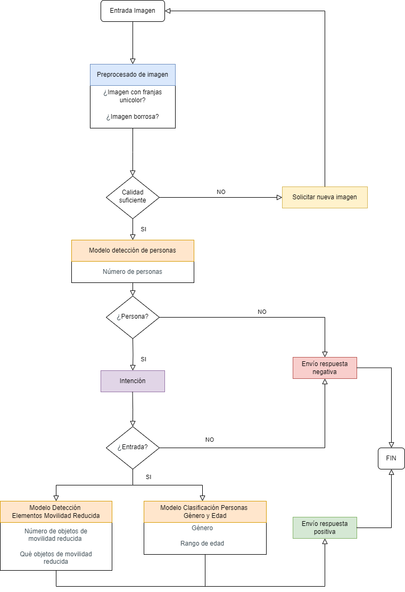
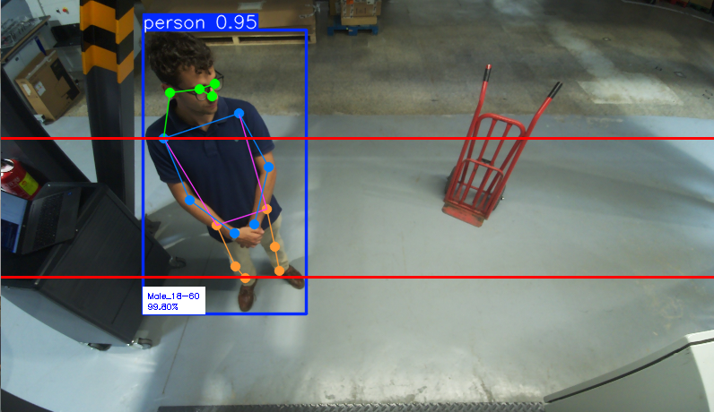
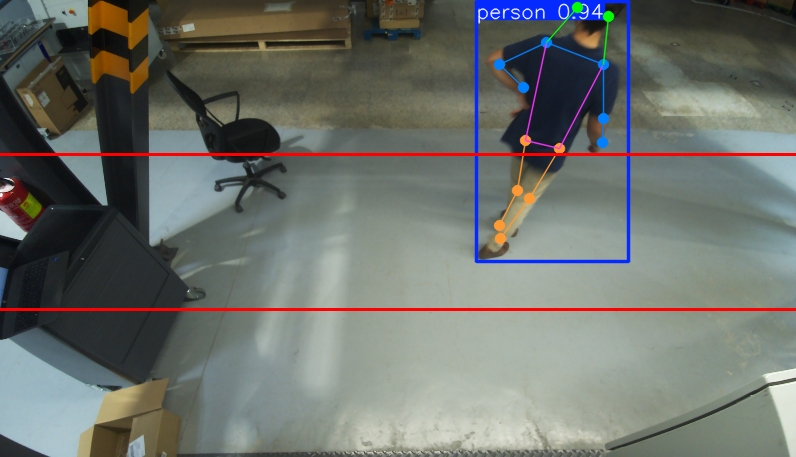

# Proyecto de Detección de Personas, Objetos Especiales y Clasificación de Género

Este proyecto utiliza modelos de detección y clasificación de imágenes basados en YOLO para identificar personas, detectar objetos especiales de movilidad y clasificar el género de las personas detectadas en imágenes. También incluye un sistema de registro que almacena información sobre las predicciones en un archivo de log. 

Para tener claro como funciona el sistema seguiremos el diagrama de flujo inferior, en el que si lo observamos, vemos como primero se realiza un preprocesado de la imagen para evaluar su calidad, si esta es apta, entrara en acción el modelo de IA de detección de personas, si encuentra a personas entonces evaluará su intención de interactuar con el ascensor. En el caso de ser positiva entonces entrarán dos modelos de IA, uno para clasificar a dicha persona según género y edad y otro para evaluar si porta algún objeto de movilidad reducida. Finalmente estos datos se almacenan en un log. 

## Images



## Links

Descarga los modelos de IA en el siguiente enlace [Enlace de descarga](https://mega.nz/file/PZB2SQja#BzYOVlGi82S3RFb7W31lg9X3nn_U1aBxDC4JgS3LwGc) y pégalos en la carpeta /models

## Tabla de Contenidos

- [Descripción General](#descripción-general)
- [Requisitos del Sistema](#requisitos-del-sistema)
- [Estructura del Proyecto](#estructura-del-proyecto)
- [Funcionamiento del Proyecto](#funcionamiento-del-proyecto)
- [Instrucciones de Uso](#instrucciones-de-uso)
- [Registro de Predicciones](#registro-de-predicciones)
- [Funcionalidades del Proyecto](#funcionalidades-del-proyecto)
- [Notas y Recomendaciones](#notas-y-recomendaciones)

## Descripción General

Este proyecto combina la capacidad de varios modelos de YOLO para:

1. **Detección de Personas**: Localiza personas en una imagen utilizando un modelo YOLO entrenado específicamente para detección de personas.
2. **Detección de Objetos Especiales**: Una vez detectadas presencia de personas, identifica objetos relacionados con la movilidad como sillas de ruedas, andadores y muletas.
3. **Clasificación de Género**: Una vez detectadas las personas, se extraen sus rasgos fisicos y se clasifica su género y edad utilizando otro modelo especializado.
4. **Registro de Resultados**: Los resultados de cada análisis se guardan en un archivo CSV para su posterior consulta.

## Requisitos del Sistema

### Dependencias Principales

- Python 3.8 o superior
- OpenCV
- Ultralytics YOLO
- NumPy

### Instalación de Dependencias

Ejecuta el siguiente comando para instalar las dependencias necesarias:
```
pip install opencv-python-headless ultralytics numpy

```

## Estructura del Proyecto

├── models/                      
├── logs/       
├── src/                   
    ├── utils.py                     
    ├── image_processing.py          
    ├── model_analysis.py            
    ├── main.py                      
├── README.md                    

## Funcionamiento del Proyecto

### Flujo General

1. **Cargar una Imagen**: El usuario proporciona la ruta de una imagen.
2. **Evaluación de Calidad**: Se analiza la calidad de la imagen para verificar si es adecuada para su procesamiento (sin franjas unicolor ni desenfoques excesivos).
3. **Detección de Personas**: Utilizando un modelo YOLO, se detectan las personas en la imagen.
4. **Detección de Objetos Especiales**: Con otro modelo YOLO, una vez detectadas presencia de personas, se identifican objetos relacionados con la movilidad (sillas de ruedas, andadores, etc.).
5. **Clasificación de Género y Edad**: Si se detectan personas, se extraen sus rasgos fisicos y se clasifica el género y edad de cada una.
6. **Registro de Resultados**: Los resultados de la detección y clasificación se registran en un archivo CSV con información detallada (número de personas, objetos especiales, clasificación de género, etc.).

## Intrucciones de Uso

1. **Ejecutar la Detección y Clasificación:**
Para realizar una predicción sobre una imagen, ejecuta el script main.py con la ruta de la imagen que deseas analizar:

```
python main.py
```

2. **Parámetros de Ejecución**:
- **image_path**: Ruta de la imagen que será analizada.
- **log_file_path**: Ruta del archivo donde se guardarán los resultados de las predicciones.
- **lift_id**: Identificador del dispositivo (por ejemplo, el ID del ascensor si se está utilizando en un sistema de ascensores).
- **model_version**: Versión del modelo que se está utilizando.


## Registro de las Predicciones

Las predicciones se registran en un archivo CSV. Si el archivo no existe, se crea automáticamente. El CSV contiene las siguientes columnas:

- **request_id**: ID único generado aleatoriamente para cada análisis.
- **timestamp**: Fecha y hora en la que se realizó el análisis.
- **lift_id**: Identificador del ascensor o dispositivo relacionado.
- **model_version**: Versión del modelo utilizado.
- **special_objects**: Número de objetos especiales detectados.
- **wheelchairs**: Número de sillas de ruedas detectadas.
- **walkers**: Número de andadores detectados.
- **crutches**: Número de muletas detectadas.
- **num_people**: Número de personas detectadas.
- **gender_classification**: Clasificación de género y edad de las personas detectadas (si aplica).

```
request_id,timestamp,lift_id,model_version,special_objects,wheelchairs,walkers,crutches,num_people,gender_classification
A1B2C,2024-10-06 14:35:21,LIFT_001,v1.0,1,1,0,0,1,Male_18-60
```

## Funcionalidades del Proyecto

1. **Detección de Personas:**
El modelo yolo11x-pose.pt es el encargado de identificar personas y su pose dentro de una imagen. Además, se dibujan líneas de referencia en la imagen para facilitar la evaluación de las posiciones clave de las personas.

2. **Deducción de intencionalidad**
La imagen procedente de la cámara se divide en tres secciones horizontales iguales con el objetivo de identificar si una persona tiene intención de entrar en el ascensor o no. Para ello se evalua su pose respecto a estas tres referencias con la siguiente casuística:
- Si no se le detectan ambos ojos se entiende que la persona se encuentra de paso (de izquierda a derecha de la imagen o viceversa) o dicha persona está de espaldas.
- Si se le detectan ambos ojos pero la cadera (y por ende la cabeza) se encuentra en la parte superior de la imagen afirmamos que es alguien parado demasiado lejos del ascensor como para querer entrar
- Si se le detectan ambos ojos pero la cadera o la cabeza se encuentran en la zona media de la imagen podemos confirmar que esa persona cumple con los requisitos como para querer entrar.






3. **Detección de Objetos Especiales:**
El modelo best18-new.pt detecta objetos como sillas de ruedas, andadores y muletas. Las cajas delimitadoras (bounding boxes) se dibujan en verde en la imagen generada.

4. **Clasificación de Género:**
Una vez detectadas las personas, se extraen los rostros de cada persona y se clasifican utilizando el modelo bestClasiNew2.pt. Los resultados incluyen el género de cada persona detectada, y se muestran junto con la confianza de la predicción.

5. **Evaluación de la Calidad de la Imagen:**
Se analiza la imagen para verificar que tenga la calidad suficiente para ser procesada. Se busca evitar procesar imágenes desenfocadas o con franjas unicolor que puedan comprometer los resultados.

6. **Registro de Resultados:**
El sistema genera un archivo de log que almacena los resultados de cada predicción. Este archivo puede ser consultado posteriormente para llevar un seguimiento de todas las predicciones realizadas.

## Notas y Recomendaciones  

- Asegúrate de que las imágenes proporcionadas tengan una calidad suficiente (sin desenfoques o franjas de un solo color) para obtener mejores resultados.
- El rendimiento del sistema puede variar según la calidad y tamaño de los modelos YOLO utilizados. Es recomendable ajustar los modelos para casos de uso específicos.
- El archivo de log crece con cada ejecución. Asegúrate de limpiar o respaldar este archivo si se vuelve demasiado grande.